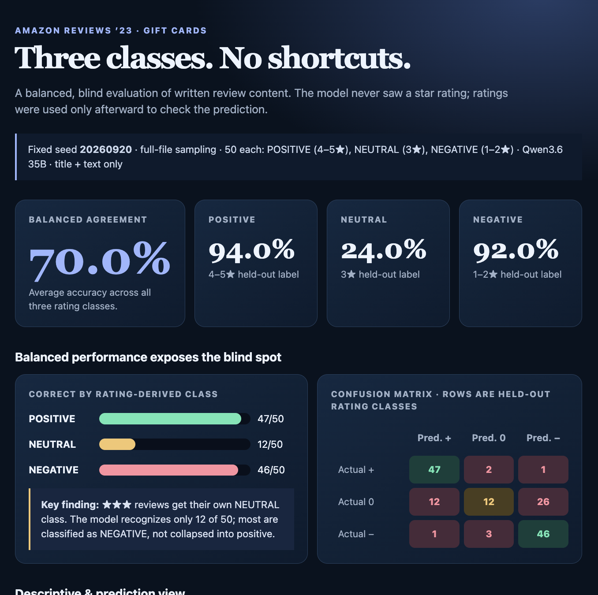
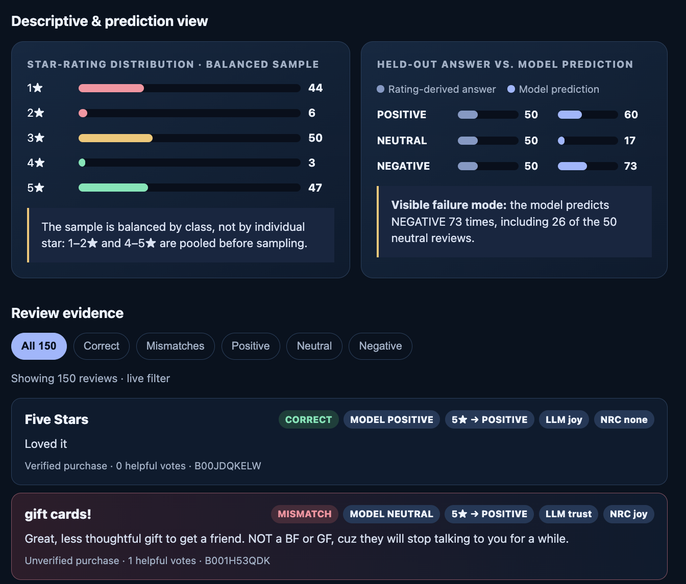

# Amazon Gift Cards review sentiment classifier

## What this project does

This evaluation classifies Amazon Gift Cards review **title + text only** as `POSITIVE`, `NEUTRAL`, or `NEGATIVE`, then checks that blind prediction against the held-out star-rating class:

| Rating | Held-out class |
| ------ | -------------- |
| 4–5★   | POSITIVE       |
| 3★     | NEUTRAL        |
| 1–2★   | NEGATIVE       |

It also assigns a primary emotion in two independent ways: an LLM chooses one of eight emotions, and the NRC word-emotion lexicon scores individual words. The static dashboard lets readers inspect the aggregate results and every evaluated review.

## Data source

Reviews come from the **Amazon Reviews ’23** dataset, collected by the McAuley Lab at UC San Diego. This project uses the `Gift_Cards.jsonl.gz` review category. The dataset documentation describes its fields and category-level scale, including the Gift Cards review download: [Amazon Reviews ’23 dataset page](https://amazon-reviews-2023.github.io/). The direct public review file is [Gift_Cards.jsonl.gz](https://mcauleylab.ucsd.edu/public_datasets/data/amazon_2023/raw/review_categories/Gift_Cards.jsonl.gz).

The NRC baseline uses the public NRC Word-Emotion Association Lexicon (v0.92), whose eight emotion categories are anger, anticipation, disgust, fear, joy, sadness, surprise, and trust. See the [NRC lexicon documentation](https://www.nrc.canada.ca/en/research-development/products-services/technical-advisory-services/sentiment-emotion-lexicons).

## Reproducible balanced run

The model was `cyankiwi/Qwen3.6-35B-A3B-AWQ-4bit`, called with temperature 0. The model received no rating field. A fixed seed (`20260920`) drew 50 reviews per held-out class from the full Gift Cards file:

| Held-out class       | Sample size | Correct | Class accuracy |
| -------------------- | ----------: | ------: | -------------: |
| POSITIVE (4–5★)      |          50 |      47 |          94.0% |
| NEUTRAL (3★)         |          50 |      12 |          24.0% |
| NEGATIVE (1–2★)      |          50 |      46 |          92.0% |
| **Balanced average** |     **150** | **105** |      **70.0%** |

The earlier sequential 100-row check reported 98.0% agreement, but 93 of those rows had 4–5★ ratings. It was therefore dominated by an easy, majority-positive class. Equal sampling reduces that illusion: clear positive and negative reviews remain strong, while the previously underrepresented neutral class falls to 24.0%.

## Where predictions go wrong

The full confusion matrix is below. Rows are the rating-derived answer; columns are blind model predictions.

| Actual \ Predicted | POSITIVE | NEUTRAL | NEGATIVE |
| ------------------ | -------: | ------: | -------: |
| POSITIVE           |       47 |       2 |        1 |
| NEUTRAL            |       12 |      12 |       26 |
| NEGATIVE           |        1 |       3 |       46 |

The principal failure is directional: **26 of 50 neutral (3★) reviews are called negative**. Another 12 neutral reviews are called positive. In contrast, only 1 negative review is called positive and only 3 are called neutral. Three-star reviews have their own class throughout the prompt, scoring, and dashboard; the model is the component that tends to interpret their mixed content as negative.

## Emotion comparison

LLM and NRC primary emotions match on **18 of 150 reviews (12.0%)**. The LLM labels 61 reviews as anger and 56 as joy; NRC labels 77 as anticipation and 14 as joy. This is expected from the method difference: the LLM weighs the review’s overall meaning, while NRC adds independent word associations. In this run, 63 reviews have a tied highest NRC score and 35 have no matched NRC emotion word; the script resolves nonzero ties using its fixed category order, which can favor anticipation. NRC is an independent lexical baseline, not emotion ground truth.

## Files

- [`outputs/classifier-prompt.md`](outputs/classifier-prompt.md) — exact three-class, rating-blind prompt.
- [`outputs/repro/prepare-balanced-sample.mjs`](outputs/repro/prepare-balanced-sample.mjs) — deterministic full-file sampling.
- [`outputs/repro/classify-balanced-chunk.mjs`](outputs/repro/classify-balanced-chunk.mjs) — model scoring plus LLM emotion capture.
- [`outputs/repro/add-nrc-emotions.mjs`](outputs/repro/add-nrc-emotions.mjs) — standalone NRC word-list scorer.
- [`outputs/repro/build-balanced-dashboard.mjs`](outputs/repro/build-balanced-dashboard.mjs) and [`outputs/repro/add-viz-to-dashboard.mjs`](outputs/repro/add-viz-to-dashboard.mjs) — dashboard generators.
- [`outputs/gift-cards-balanced-150-evaluation.json`](outputs/gift-cards-balanced-150-evaluation.json) — raw balanced-run output.
- [`gift-cards-balanced-three-class-dashboard.html`](gift-cards-balanced-three-class-dashboard.html) — offline interactive dashboard.

To rerun LLM scoring, set `LLM_API_KEY` in your shell before running `classify-balanced-chunk.mjs`; no API token is stored in this repository.

## Author review and implementation notes

This README was drafted by the coding agent from the saved evaluation output, then checked against the saved class totals, confusion matrix, emotion counts, and dashboard data. The conclusions above are my reviewed framing of those numbers: the classifier is reliable for clear polar sentiment but should not be presented as strong three-class sentiment classification until neutral handling improves.

The main implementation issue was chart visibility: very small chart values can disappear if a calculated width rounds to zero. The dashboard applies a small visible minimum width while retaining the exact count as text. Automated local-browser capture was unavailable in the environment, so the included screenshots were captured manually from the finished dashboard instead.

## Screenshot

The final interface is the offline [`gift-cards-balanced-three-class-dashboard.html`](gift-cards-balanced-three-class-dashboard.html).

